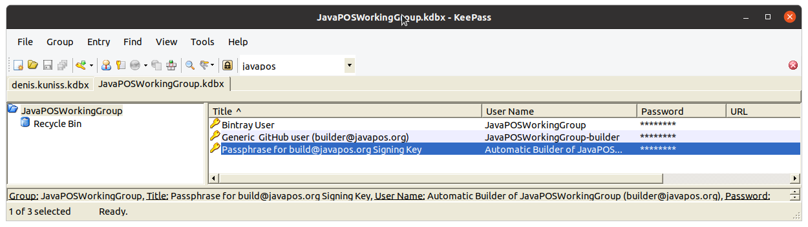

# Editorial Project
This project contains editorial information about how projects, build and release process are set up.

## Release Process

The release process of the libraries is described in detail on Denis' blog article ["How To Set Up a Continuous Integration Process in the Cloud"](http://blog.grammarcraft.de/2016/04/23/set-up-a-continuous-integration-process-in-the-cloud/). However since that it was adapted to run on GitHub Actions as Travis-CI is not for free anymore.

## Passwords and Keys

The passwords and cryptographic keys used in this release process are stored in the Keepass database file [editorial/JavaPOSWorkingGroup.kdbx](JavaPOSWorkingGroup.kdbx) in this proejct. For accessing this file, the Keepass application has to be downloaded and installed from http://keepass.info/download.html. There are different ports for a bunch of operating systems available.

The password to this Keepass database file is known to the committee members; in case of questions ask Denis.

The passwords for release process relevant steps are stored in the root of the Keepass database.


The cryptographic keys for signing are attached to the ''Passphrase for build@javapos.org Signing Key'' Keepass database entry.


## Image Resources

Avatar images and logos used on different web sites related to this organization are stored at the sub directory [editorial/resources
](resources). The avatar images are used especially at the [Bintray repositories](https://bintray.com/javaposworkinggroup/maven). 

## Manual Import Process of The Historic Sources

The *build.gradle* files are prepared to import the historic sources from http://javapos.com.
The following steps has been applied for importing:
- as precondition, the variable *javaposImportDir* must be set in user's *gradle.properties* file pointing to the directory where the source zip file has been downloaded to (one time task)
```
# for JavaPOS committee file import only
javaposImportDir=C:/Users/denis.kuniss/Documents/JavaPOS-Import
```
- download the appropriate source zip file from hhtp://javapos.com
- adapt the date part *yyyymmdd* of the zip file into at Gradle task *importSources*
```
	def javaposSourceZipFile ="$javaposImportDir/JavaPOS-$version-Source-yyyymmdd.zip"
```
- go to the top and adapt the project's UnifiedPOS and release version variables
```
def uposVersion = '1.14'
version="${uposVersion}.0" // the last part after dot is the build/release version
```
- adapt the JavaPOS dependency versions, if any
```
// dependency versions
def javaposContractsVersion = "$uposVersion.0"
def javaposControlsVersion  = "$uposVersion.0"
def jclVersion = '2.2.0'
```
- execute task *importSources*
- execute task *addLicenseHeader* which will add the comittee agreed [CPL license](http://www.ibm.com/developerworks/library/os-cpl.html) header to all imported source files
- commit the changes
