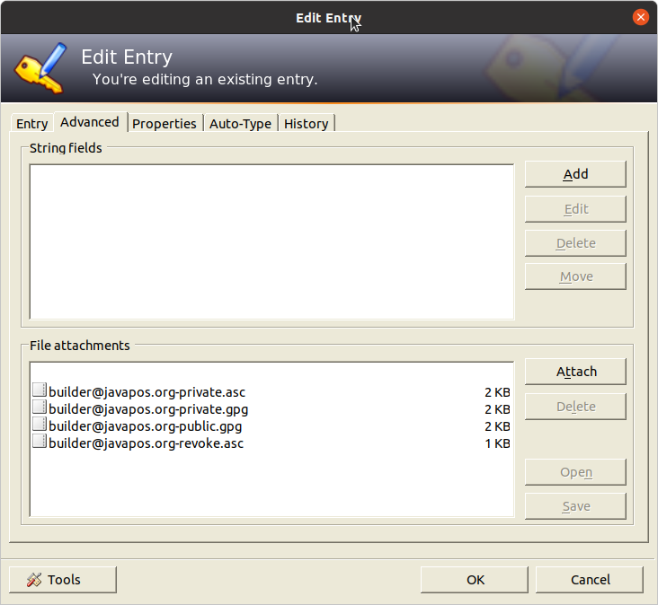

# Editorial Project
This project contains editorial information about how projects, build and release process are set up.

## Release Process

The release process of the libraries is described in detail on Denis' blog article ["How To Set Up a Continuous Integration Process in the Cloud"](http://blog.grammarcraft.de/2016/04/23/set-up-a-continuous-integration-process-in-the-cloud/).

## Passwords and Keys

The passwords and cryptographic keys used in this release process are stored in the Keepass database file [editorial/JavaPOSWorkingGroup.kdbx](JavaPOSWorkingGroup.kdbx) in this proejct. For accessing this file, the Keepass application has to be downloaded and installed from http://keepass.info/download.html. There are different ports for a bunch of operating systems available.

The password to this Keepass database file is known to the committee members; in case of questions ask Denis.

The passwords for release process relevant steps are stored in the root of the Keepass database.

The cryptographic keys for signing are attached to the ''Signing Key for Bintray'' Keepass database entry.

## Image Resources

Avatar images and logos used on different web sites related to this organization are stored at the sub directory [editorial/resources
](resources). The avatar images are used especially at the [Bintray reposotries](https://bintray.com/javaposworkinggroup/maven). 
